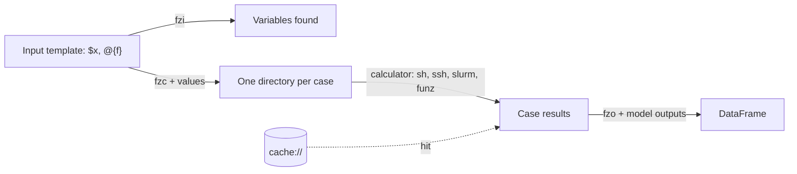

# Core Concepts

FZ separates **what** varies (the template), **how** to read and parse it (the model),
**where** it runs (the calculator) and **which** values to run (the design). Each part
is defined independently and can be reused with the others.



`fzr` chains all steps for a list of cases; `fzd` repeats them in a loop, asking an
algorithm for the next cases after each batch.

## Vocabulary

| Term | Definition | Page |
|------|------------|------|
| **Template** | The code's own input file(s), with `$variables`, `@{formulas}` and `#@` context lines. A file or a whole directory tree. | [Template syntax](../user-guide/templates/syntax.md) |
| **Model** | A dict (or JSON alias) giving the template syntax and the `output` extractors. It never says how to run the code. | [Model definition](../user-guide/models/definition.md) |
| **Calculator** | A URI saying where and how to run one case: `sh://`, `ssh://`, `slurm://`, `slurm-array://`, `funz://`, or `cache://`. | [Calculators](../user-guide/calculators/overview.md) |
| **Case** | One combination of values: one compiled copy of the template, one run, one result directory, one DataFrame row. | [Results](../user-guide/running/results.md) |
| **Design** | The set of cases: a dict of lists (full factorial), a DataFrame (one row per case), or an algorithm (`fzd`). | [fzr](../user-guide/core-functions/fzr.md), [fzd](../user-guide/core-functions/fzd.md) |
| **Alias** | A named model, calculator or algorithm stored under `./.fz/` or `~/.fz/`. | [.fz directory](../reference/configuration.md) |

## Designs

```python
# Full factorial: Cartesian product of the lists; scalars are fixed values
{"T": [10, 20, 30], "V": [1, 2], "n": 1.0}          # 3 x 2 = 6 cases

# Explicit list of cases: one row = one case (LHS, imported plans, constrained designs)
import pandas as pd
pd.DataFrame({"T": [10, 20, 10], "V": [1, 1, 2], "n": 1.0})   # 3 cases

# Adaptive (fzd): ranges and fixed values as strings, the algorithm picks the points
{"T": "[0;100]", "V": "[1;5]", "n": "1"}
```

## What happens for one case

1. The template is compiled with the case's values into the results directory
   (`results/T=10,V=1,n=1.0/` by default) and the SHA-256 of the inputs is written to
   `.fz_hash`.
2. If a `cache://` calculator finds a previous case with the same hash and valid outputs,
   its results are copied and the case is `done`.
3. Otherwise a free calculator runs the command in a temporary directory, with the
   compiled input file names appended to the command line; stdout and stderr go to
   `out.txt` and `err.txt`.
4. Result files are copied back, the model's `output` extractors run in the case
   directory, and the values become the case's row.
5. On failure the case is retried, possibly on another calculator, up to
   `FZ_MAX_RETRIES` (5) failures.

## Parallelism

Each non-cache calculator entry runs one case at a time. The number of entries is the
number of cases running concurrently:

```python
calculators = ["sh://bash calc.sh"] * 4          # 4 local cases at a time
calculators = ["cache://previous", "ssh://u@a/bash /x/run.sh", "ssh://u@b/bash /x/run.sh"]
```

`FZ_MAX_WORKERS` only caps this number. See
[Parallelism & Retries](../user-guide/running/parallel.md).

## Results

`fzr` returns a pandas DataFrame with the variables, the outputs, and the columns
`status` (`done`, `failed`, `error`, `timeout`, `interrupted`), `calculator`, `error`,
`command`. Every case also leaves a directory with its inputs, outputs and logs, and the
results root holds `manifest.json` for traceability. See
[Results & Traceability](../user-guide/running/results.md).

## Configuration

Defaults come from `FZ_*` environment variables, read when `fz` is imported (call
`fz.reload_config()` after changing `os.environ`). Aliases come from `./.fz/` then
`~/.fz/`. See [Environment Variables](../reference/environment.md) and
[.fz Directory & Aliases](../reference/configuration.md).

## Next

- [Input Template Syntax](../user-guide/templates/syntax.md)
- [Model Definition](../user-guide/models/definition.md)
- [Constraints & Limits](../reference/limitations.md)
